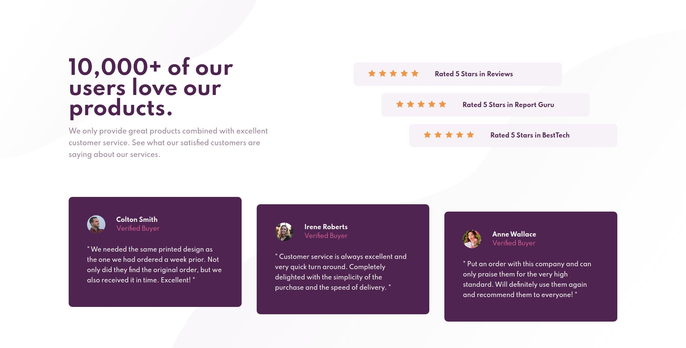

# Frontend Mentor - Social proof section

This is a solution to the [Social proof section challenge on Frontend Mentor](https://www.frontendmentor.io/challenges/social-proof-section-6e0qTv_bA).

## Overview

### The challenge

Users should be able to:

- View the optimal layout for the section depending on their device's screen size

### Screenshot

### Links

- [Solution URL](https://github.com/Adilsongb/social-proof-section)
- [Live Site URL](https://social-proof-section-puce-one.vercel.app/)

## My process

### Built with

- Semantic HTML5 markup
- CSS custom properties
- Flexbox
- Mobile-first workflow
- Javascript

## Author

- Frontend Mentor - [@Adilsongb](https://www.frontendmentor.io/profile/Adilsongb)
- Twitter - [@_adilsongb](https://twitter.com/_adilsongb)